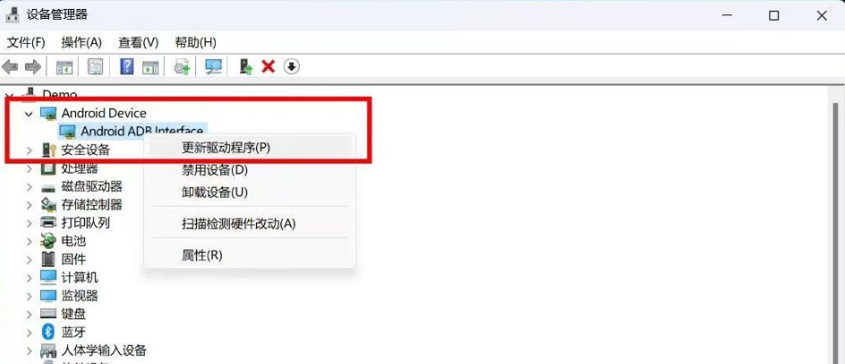
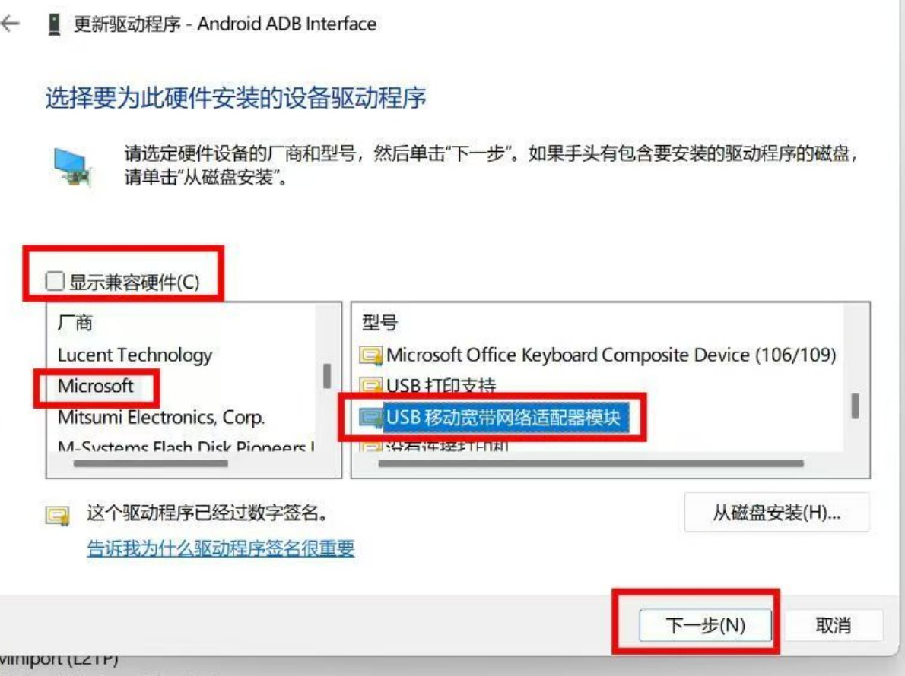
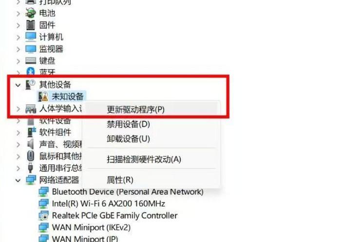
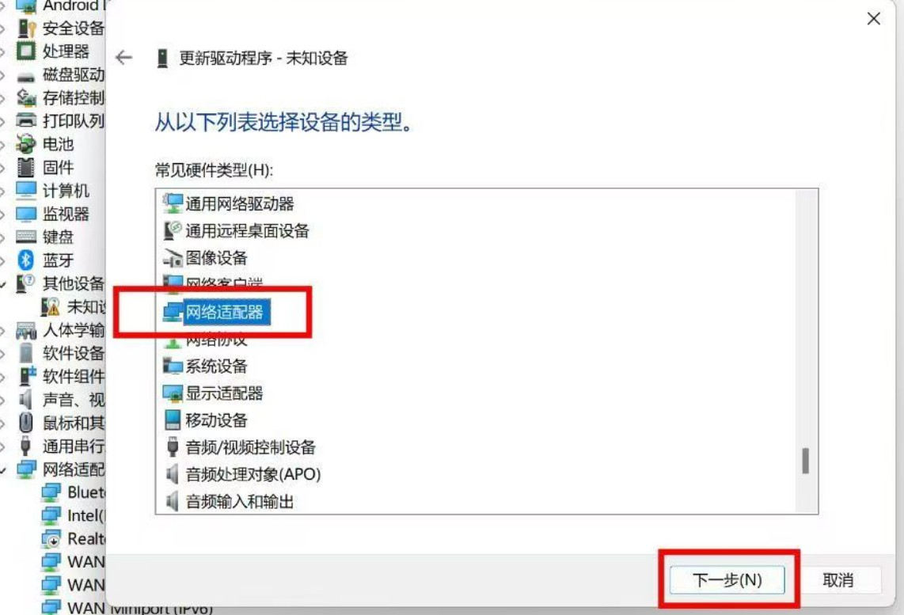
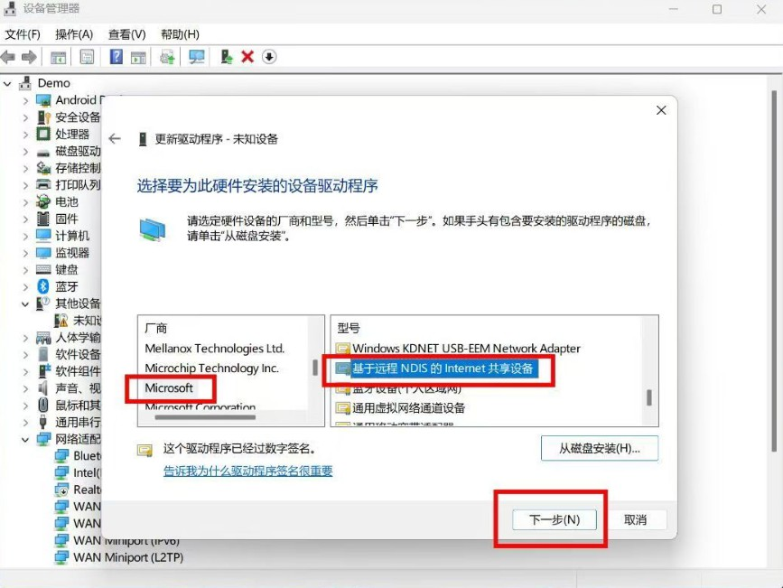
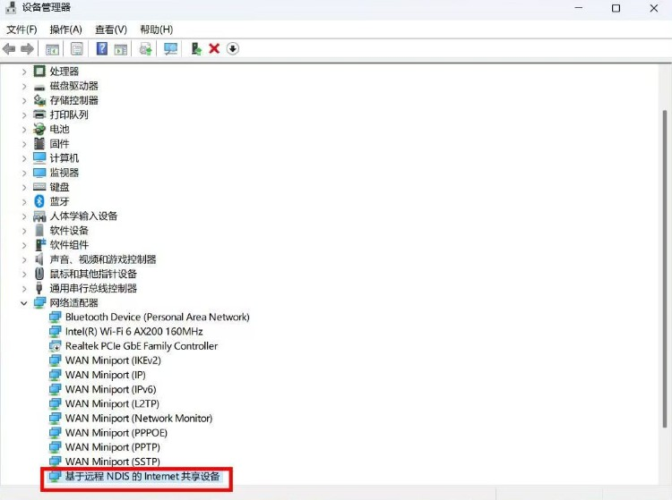

## 1.刷入debian

> 苏苏小亮亮包

打开文件所在目录 在地址栏输入 cmd 后 输入 flash.bat

2022-06-08 [点击下载](https://www.123pan.com/s/XwVDVv-WICn3)

!!! note
    该版本默认是随身WIFI模式，开机后自动开启热点，名称：4G_UFI_123456，密码：12345678，并且会开机USB网络共享
    
    该版本可在随身WIFI和遥控车模式间切换，SSH登录到Debian系统，执行./ufi.sh,根据提示可切换模式和修改热点密码

## 2.手动更新驱动

!!! tip
    刷完Debian后开机，设备管理器里会显示一个ADB设备，但是这样连不上SSH，所以需要手动修改，使它能够识别到棒子的USB网络共享

打开设备管理器，右键识别到的ADB设备，依次右键点击 > 更新驱动 > 浏览我的电脑... >; 让我从计算机上... > 取消勾选显示兼容硬件，接着可以跟我一样选择左边的Microsoft，再选择右边的这个USB移动宽带...，再点击下一步后根据提示确认





操作完后重新拔插棒子，等待棒子开机，观察设备管理器是否出现一个未知设备。出现了之后依次右键点击 > 更新驱动 > 浏览我的电脑... > 让我从计算机上... > 网络适配器 > 下一步 > 左边选择Microsoft >; 右边选择基于远程NDS的...，接着点击下一步根据提示确认







最后手动更新驱动后设备管理器会出现它，这样才能进行下一步的SSH登录操作



## 3.ssh连接

用户名`root`

密码`1`

安装完debian后 设备管理器里出现未知设备

若没有出现未知设备 将驱动更新为 **Composite USB Device** 即可

右键未知设备 更新驱动 选择 浏览我的计算机以查找驱动程序软件  让我从计算机上的可用驱动列表中选取 microsoft ***基于远程rndis设备的usb共享***


## 4.debian连接wifi

使用命令 `nmtui`

网桥里删除wifi 否则不显示附近的wifi

## 5.换源

进入`etc/apt/souces.list` 添加下面[清华源](https://mirrors.tuna.tsinghua.edu.cn/help/debian/) 

```
# 默认注释了源码镜像以提高 apt update 速度，如有需要可自行取消注释
deb https://mirrors.tuna.tsinghua.edu.cn/debian/ bullseye main contrib non-free
# deb-src https://mirrors.tuna.tsinghua.edu.cn/debian/ bullseye main contrib non-free
deb https://mirrors.tuna.tsinghua.edu.cn/debian/ bullseye-updates main contrib non-free
# deb-src https://mirrors.tuna.tsinghua.edu.cn/debian/ bullseye-updates main contrib non-free

deb https://mirrors.tuna.tsinghua.edu.cn/debian/ bullseye-backports main contrib non-free
# deb-src https://mirrors.tuna.tsinghua.edu.cn/debian/ bullseye-backports main contrib non-free

deb https://mirrors.tuna.tsinghua.edu.cn/debian-security bullseye-security main contrib non-free
# deb-src https://mirrors.tuna.tsinghua.edu.cn/debian-security bullseye-security main contrib non-free
```

进入`/etc/apt/sources.list.d/mobian.list`

注释掉

```
#deb http://repo.mobian-project.org/ bullseye main non-free
```

进入`/etc/apt/sources.list.d/AdoptOpenJDK.list`

将`AdoptOpenJDK`改为`Adoptium`

```
deb http://mirrors.tuna.tsinghua.edu.cn/Adoptium/deb buster main
```

由于没有公钥，无法验证下列签名： NO_PUBKEY 843C48A565F8F04B 

解决方法，添加个密钥就行 `apt-key adv --keyserver hkp://keyserver.ubuntu.com:80 --recv 843C48A565F8F04B`

更新 `apt-get update && apt-get upgrade -y `

## 6.安装docker

Docker安装很简单，一键脚本安装就行

`apt-get install curl -y ` 	安装`curl`

`curl -sSL https://get.daocloud.io/docker | sh`

## 7.python环境修复

```Shell
python3 --version
```

1、更新源：

```Shell
sudo apt-get update
```

2、先卸载：

```Shell
sudo apt-get --purge remove  python3
```

3、然后我又把没用的依赖全都卸载了：

```Shell
sudo apt-get autoremove
```

4、再重新安装：

```Shell
sudo apt install python3 python3-pip python-is-python2
```

5、到这里应该就正常了，可以重新验证下

!!! tip
	【总结】一键执行以下命令即可

```Shell
echo -e '\n\n\n\n\n\n\n\n\n\n####################################\n\n安装时间较长，请耐心等候！'
echo -e '\n即将开始安装......\n\n'
sleep 5
sudo apt-get update
sudo apt-get --purge -y remove python3 python3-pip python-is-python2
sudo apt-get autoremove -y
sudo apt install -y python3 python3-pip python-is-python2
echo -e '\n\n####################################\n'
echo -e '尝试获取当前系统安装的python版本号......\n'
python3 --version
echo -e '\n\n\n恭喜你，python环境重新安装完成！'
echo -e '\n####################################\n\n\n'
```


## 提取基带

首先**在Android系统下**（不要在已经刷好的OpenWrt下直接提取基带，那样提取了也没用）插入你的SIM卡，（可能需要切换到SIM卡1）确认能够上网之后断电取下SIM卡再上电备份。**如果Android系统下就无法上网则备份出来也是没有用的**，建议先刷一遍全量救砖包（MiKo备份的出厂包）或换一个运营商的SIM卡甚至退货处理。

确认基带可用后，将棒子进入9008模式联机，打开Qualcomm Premium Tool，按照下图操作将`modemst1`、`modemst1`、`fsc`、`fsg`四个分区单独备份到一个文件夹中，一次只能备份一个，需要循环上述备份操作直至四个分区全部备份完成。


此时进入备份文件夹，找到这四个文件，将后缀名全都改为`.bin`，然后全部拖进之前准备好的OpenWRT文件夹或Debian文件夹中替换掉原来的文件即可。


## 刷入基带

> 如果 OpenWRT 开机后显示“正在拆卸调制解调器载体”或“网络设备不存在”则再执行此步操作。**在Debian或OpenWRT下重刷基带不是必须的**，本节只是类似问题的备用解决方案。

将前面提取的基带文件（4个，分别是`modemst1.bin`、`modemst1.bin`、`fsc.bin`和`fsg.bin`）与OpenWRT/Debian刷机包文件夹下的复制到一个新的文件夹内，然后在该文件夹空白处按住Shift+右键，选择“在此处打开PowerShell窗口”或“在此处打开命令提示符”。


然后将棒子重启至Fastboot连接至电脑，在命令提示符或PowerShell中依次输入如下命令即可：

```shell
fastboot flash fsc fsc.bin
fastboot flash fsg fsg.bin
fastboot flash modemst1 modemst1.bin
fastboot flash modemst2 modemst2.bin

fastboot reboot
```
先机使用这个
```
fastboot flash modem NON-HLOS.bin
fastboot flash fsc fsc.mbn
fastboot flash modemst1 modem_st1.mbn
fastboot flash modemst2 modem_st2.mbn
fastboot reboot
```